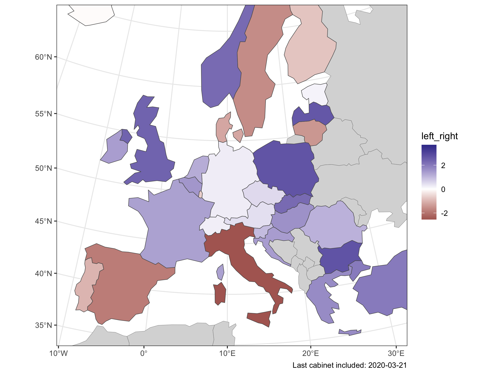

# ParlGov snippets

Snippets for dataset generation and analysis with ParlGov – [parlgov.org](http://www.parlgov.org)

[R](https://www.r-project.org/) snippets using  [tidyverse](https://www.tidyverse.org/) packages

* __cabinet-map__ -- map of cabinets left/right positions in Europe
* __cabinet-party-family__ -- country-year data on cabinets party family share
* __cabinet-type__ -- determine cabinet type: minority, minimal winning, surplus (grand coalition)
* __eu-cabinets__ -- party composition of EU cabinets on left/right and pro/contra EU dimension

