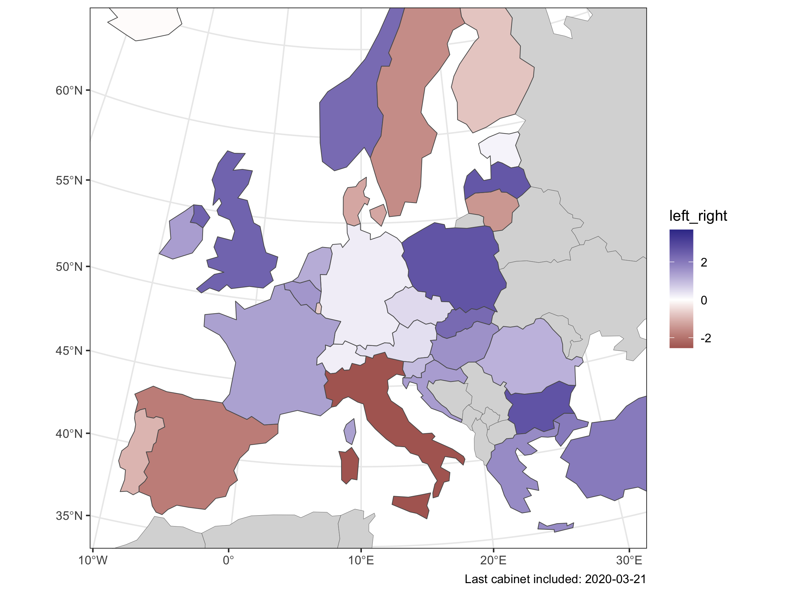

# ParlGov snippets · 🗳️ 📊

- <http://parlgov.org>
- <https://dataverse.harvard.edu/dataverse/parlgov>
- <https://parlgov.fly.dev>
- <https://github.com/hdigital/parlgov-snippets>

Snippets for dataset generation and analysis with ParlGov.

- see [parlgov-data-access.Rmd](parlgov-data-access.Rmd) examples

[R](https://www.r-project.org/) snippets using [tidyverse](https://www.tidyverse.org/) packages

- **cabinet-map** — map of cabinets left/right positions in Europe
- **cabinet-party-family** — country-year data on cabinets party family share
- **cabinet-type** — determine cabinet type: minority, minimal winning, surplus (grand coalition)
- **country-year** — country-year format party family share elections and cabinets
- **deu-election** — visualizations of German party system using election data (Authors: Lukas Warode & Philip Manow)
- **election-vanhanen** — visualizing Vanhanen Index of Democratization using election data (Author: Lukas Warode)
- **eu-cabinets** — party composition of EU cabinets on left/right and pro/contra EU dimension
- **isr-cabinet-support** — structure and patterns of Israeli cabinet support parties (Author: Lukas Warode)

---

