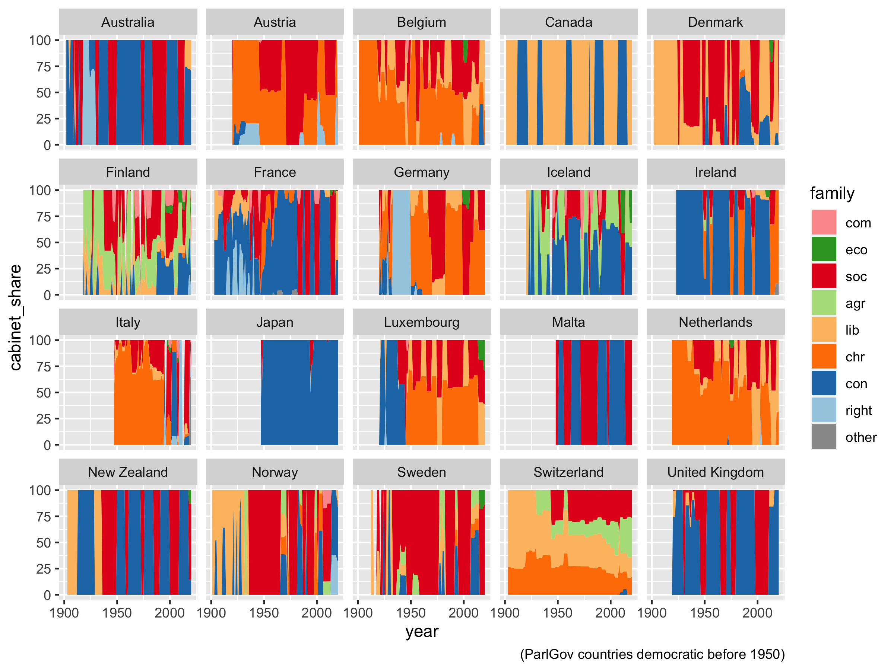

# Country-year data

Calculate _country-year format_ parliament seat share and cabinet share of party families with ParlGov data.

+ [party-family.csv](party-family-seat-share.csv) — seat share in parliament and cabinet in country-year and _long format_
+ [party-family-seat-share.csv](party-family-seat-share.csv) — seats share in parliament in country-year and _wide format_
+ [party-family-cabinet-share.csv](party-family-cabinet-share.csv) — cabinet share in country-year and _wide format_ (based on seat share cabinet parties)

_Note:_ Cabinet share is based on first cabinet in a year.

_Todo later:_

+ remove non-sovereign periods during WWII
+ replace use of [`do()`](https://dplyr.tidyverse.org/reference/do.html) (superseded in dplyr 1.0)
+ replace `spread()` and `gather()` with [pivoting](https://tidyr.tidyverse.org/articles/pivot.html) (superseded in tidyr 1.0)

---

