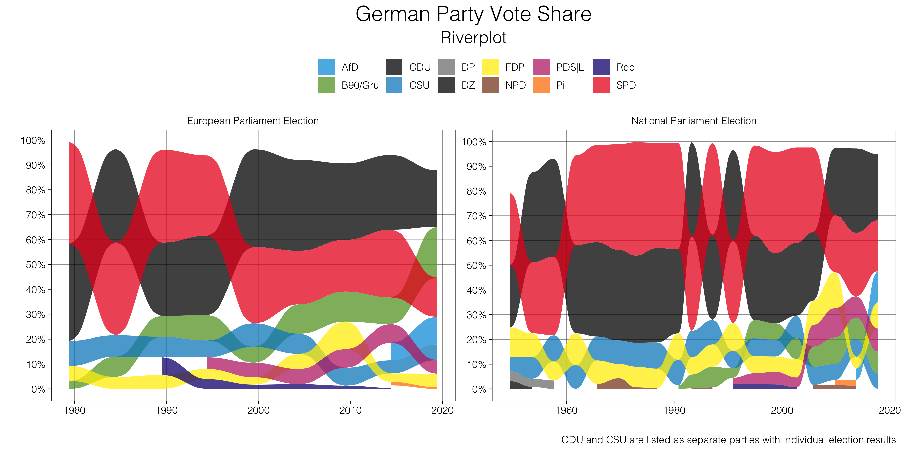

# DEU election visualizations

---

## Riverplot: German party system

* Authors: Lukas Warode and Philip Manow

### Script with data manipulation and visualizations

* Including merge data information from [Party Facts](https://partyfacts.herokuapp.com/)
* Using package [`partycoloR`](https://github.com/lwarode/partycoloR) for matching party colors

---

