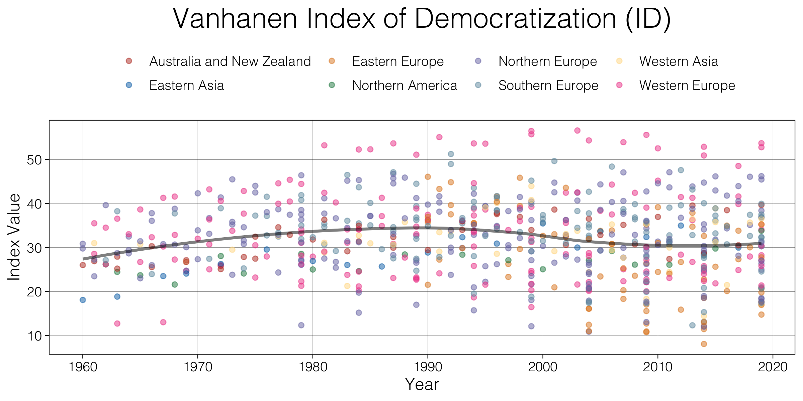
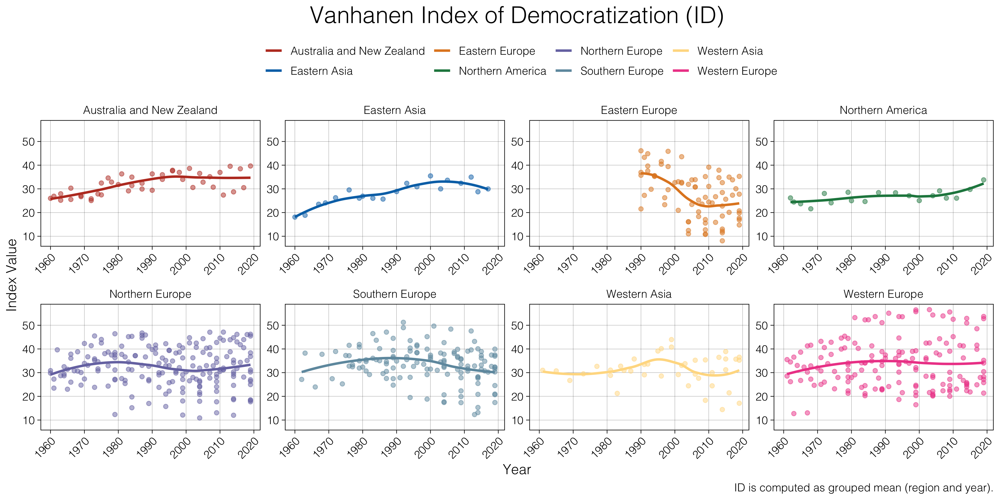

# Vanhanen Index of Democratization (ID)

---

## Measuring Democratization with *Competition* and *Participation*

### Author: Lukas Warode (inspiration from Philip Manow and Holger Döring)

The *Index of Democratization* by Tatu Vanhanen is a measure that uses party competition (*C*) and voter participation or turnout (*P*) to express the democratic condition of a state.

*C* is calculated by subtracting the percentage vote share of the largest party from 100, while *P* is the electoral participation. Both values can be calculated for every election.

The index is defined as:

Vanhanen defines the following threshold values for his index:

* *C* > 30, which means that the largest party's vote share must be lower than 70%.
* *P* > 10.

---

Vanhanen, Tatu (2010): A New Dataset for Measuring Democracy, 1810-1998. In: *Journal of Peace Research*, 37 (2), 251-265.

---

---

