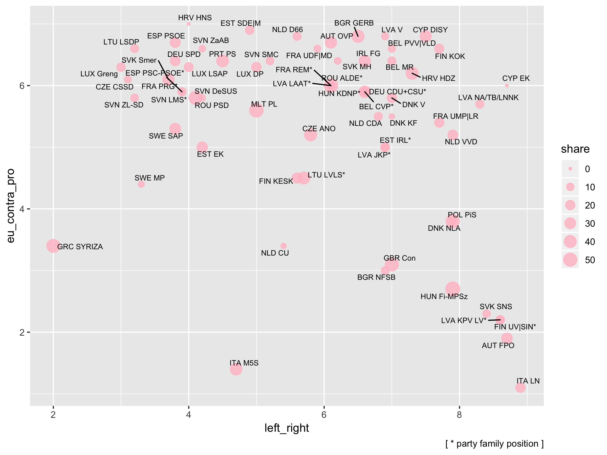

# EU cabinets

Party composition of EU cabinets on left/right and pro/contra EU dimension.

## Sources

Döring, Holger and Philip Manow. 2019. Parliaments and governments database (ParlGov): Information on parties, elections and cabinets in modern democracies. Development version.
– [parlgov.org](http://www.parlgov.org/)

Polk, Jonathan et al. 2017. “Explaining the Salience of Anti-Elitism and Reducing Political Corruption for Political Parties in Europe with the 2014 Chapel Hill Expert Survey Data.” Research & Politics 4(1): 2053168016686915.
– [chesdata.eu](https://www.chesdata.eu/)

Döring, Holger, and Sven Regel. 2019. “Party Facts: A Database of Political Parties Worldwide.” Party Politics 25(2): 97–109.
– [partyfacts.org](https://partyfacts.herokuapp.com/)

