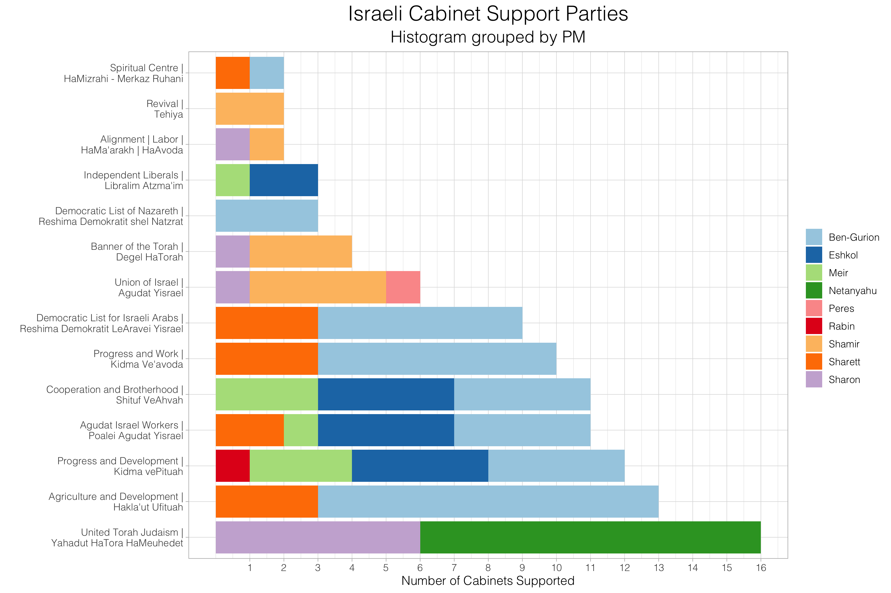
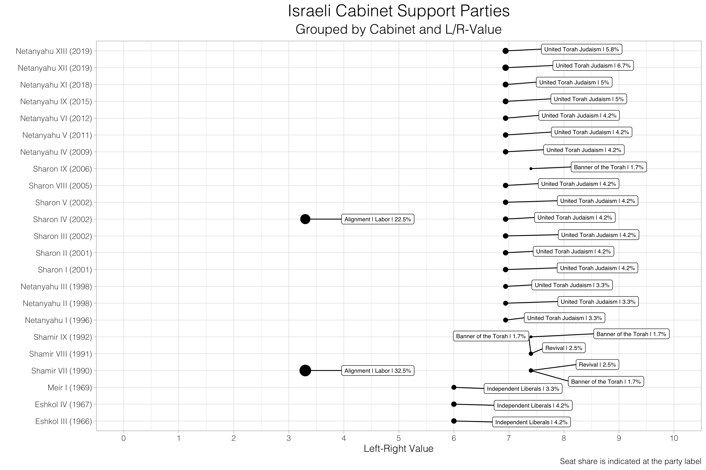
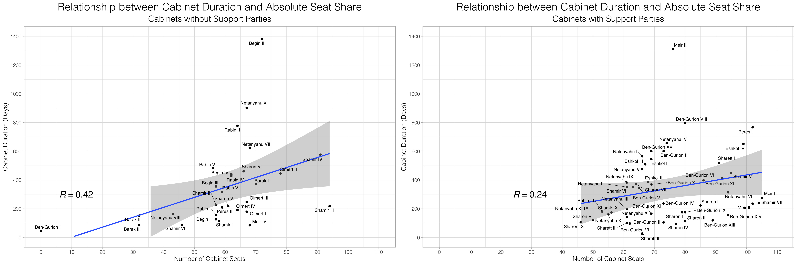

# ISR cabinet support parties -- script with data manipulation and visualizations

___

## Information
#### Author: **Lukas Warode** | Political Science student and Research Assistant (University of Bremen)

#### Description: 
The script aims to investigate and analyse the structure of *cabinet support parties* using the example of Israel. Cabinet support parties are no formal members of the cabinet, but are regularly supporting the cabinet in parliamentary affairs. For example, cabinet support parties do often ensure a parliamentary majority.

Thanks to the friendly support and knowledge of Or Tuttnauer and Ofer Kenig, the *ParlGov* database maintainer team was able to recode several Israeli cabinets and cabinet support parties.

___

## Visualizations

#### Histogram

___

#### Ideological position

___

#### Relationship between cabinet duration and cabinet size
